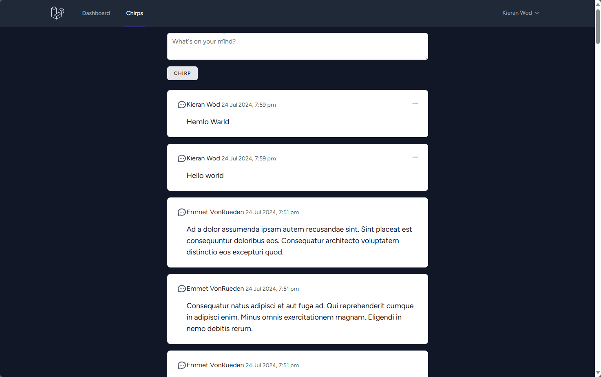
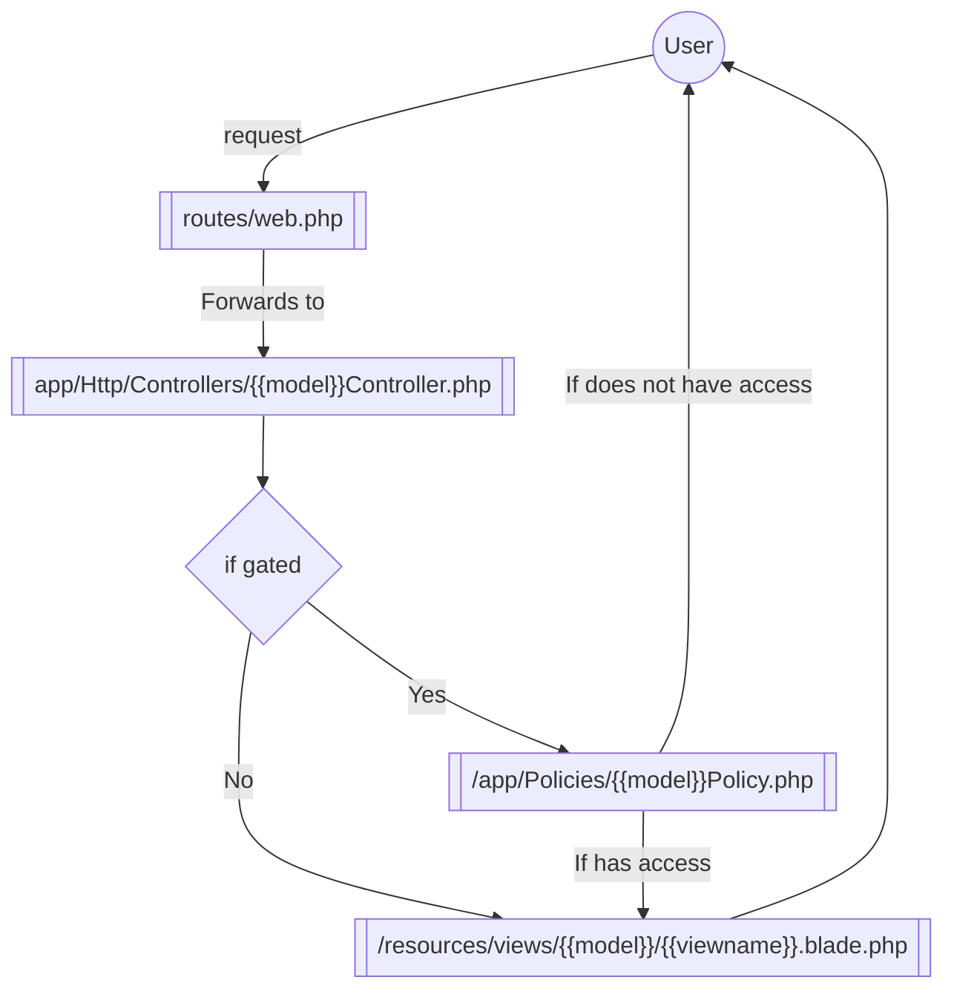
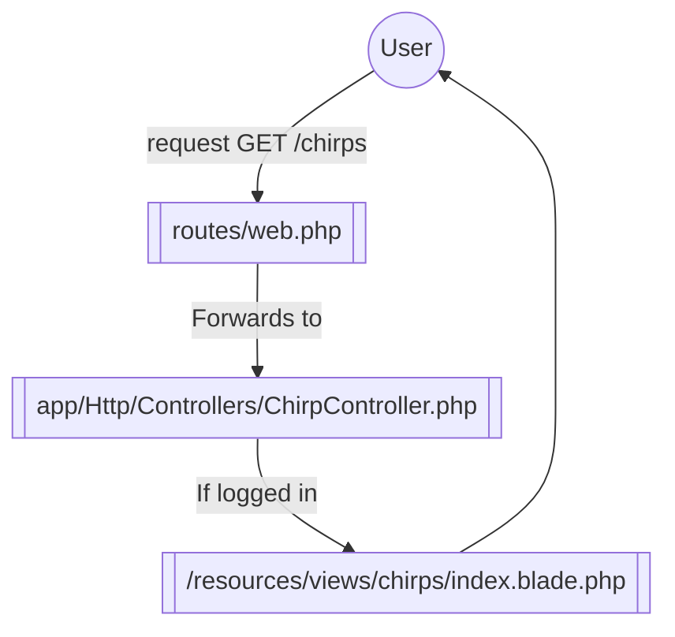
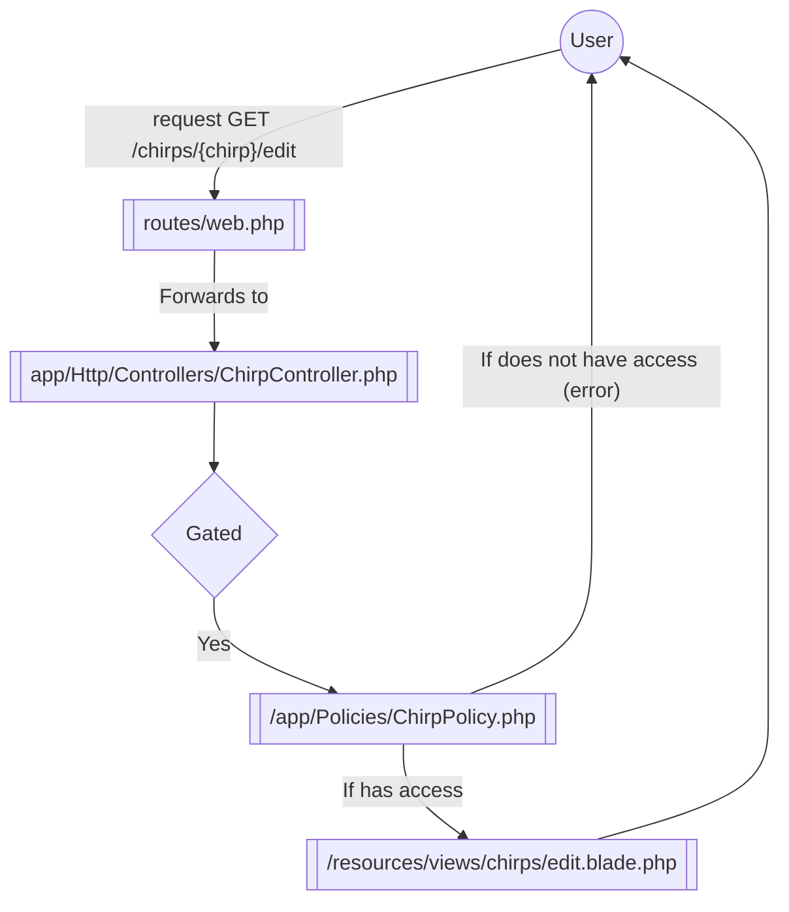

# Chirps

This is my personal repo for working on the [laravel bootcamp](https://bootcamp.laravel.com/introduction) (specifically the [blade version](https://bootcamp.laravel.com/blade/installation)).



## Architecture overview

Routing is handled by `/routes/web.php`, which in this setup allows for each model to have it's own Controller (in `app/Http/Controllers/<model>Controller.php`). 

The Controllers implement the standard CRUD operations, and when the routers call the methods the controller can then decide (based on return type) to:

- Respond natively with a `Illuminate\Http\Response` type
- Respond by passing off to a view with a `Illuminate\View\View` type
- Respond via a redirect to a view or URL with a `Illuminate\Http\RedirectResponse` type

From there we can gate certain actions behind policies found in `/app/Policies/<model>Policy.php`. This can then be added to the Controller routes using `Illuminate\Support\Facades\Gate`. For example:

```php
Gate::authorize('update', $modelInstance);
```

Will then go to `<model>Policy.php`, check the `update()` method in the class to see if the user has access, and then only continue if they do.

If a view is being used then that view can be found at `/resources/views/<model>/<viewname>.blade.php`. For example if `chirps.index` is the view being returned in the controller then `/app/resources/views/chirps/index.blade.php` is run, if `chirps.edit` is run, then change index in the last route to edit (`/app/resources/views/chirps/edit.blade.php`).

So in abstract:



Here is a more concrete example of getting `chirps.index` (a GET at `/chirps`):



Here is another with a protected view `chirps.edit` (A GET at `/chirps/{chirp}/edit`):



## Helpful commands

- `php artisan migrate:fresh --seed`: Reset DB and rerun seeding
